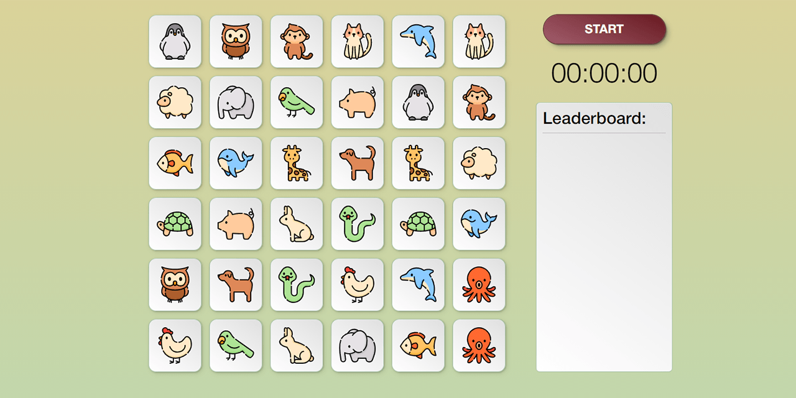

# Memory Game test assignment
**A sample frontend project on React-TypeScript**



A sample memory game application with a leaderboard.

* Current live version at [https://cat-street.github.io/creative-memory-game](https://cat-street.github.io/creative-memory-game)

---

## Usage
* Installing dependencies:
```
npm install
```
* Run in development mode:
```
npm start
```

## Features

* The game field has 18 pairs of cards with icons
* Cards position is randomized at the start of a new game
* When the card is turned up front, the player have 5 seconds to find a corresponding pair
* A timer starts with a new game
* When all the pairs are found, the game stops, and the current time result is added to the leaderboard

## Technology

* React (functional components, hooks, useState, useRef, useEffect)
* TypeScript
* JavaScript (ES6)
* SCSS Modules

## Possible improvements
* Difficulty option
